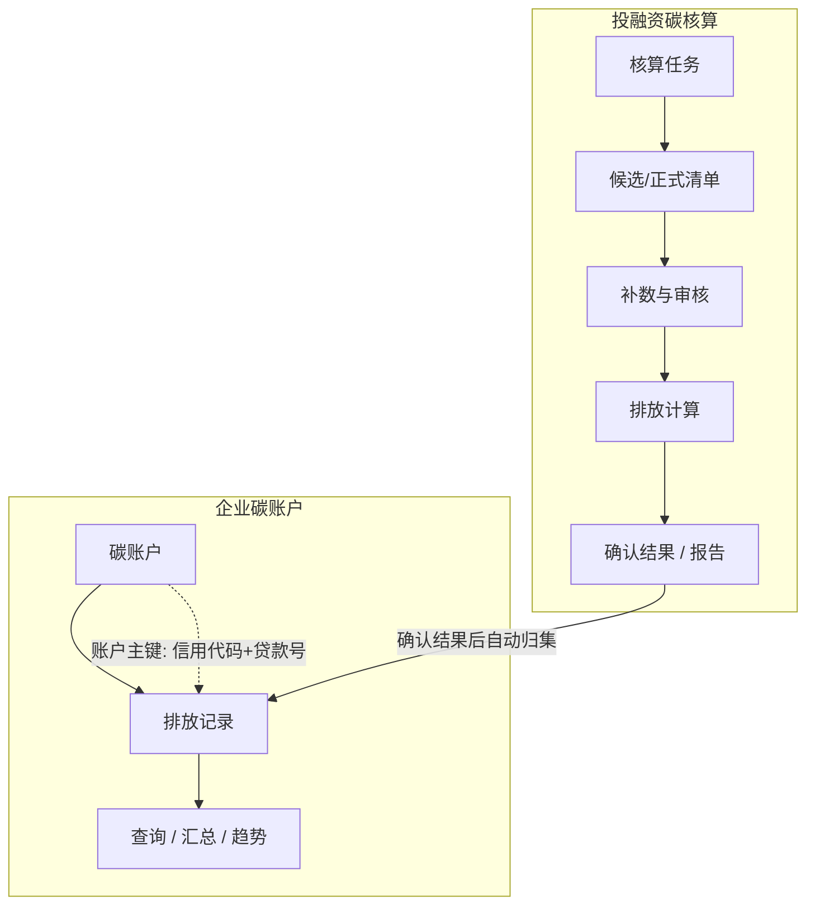
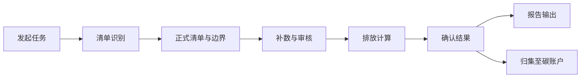
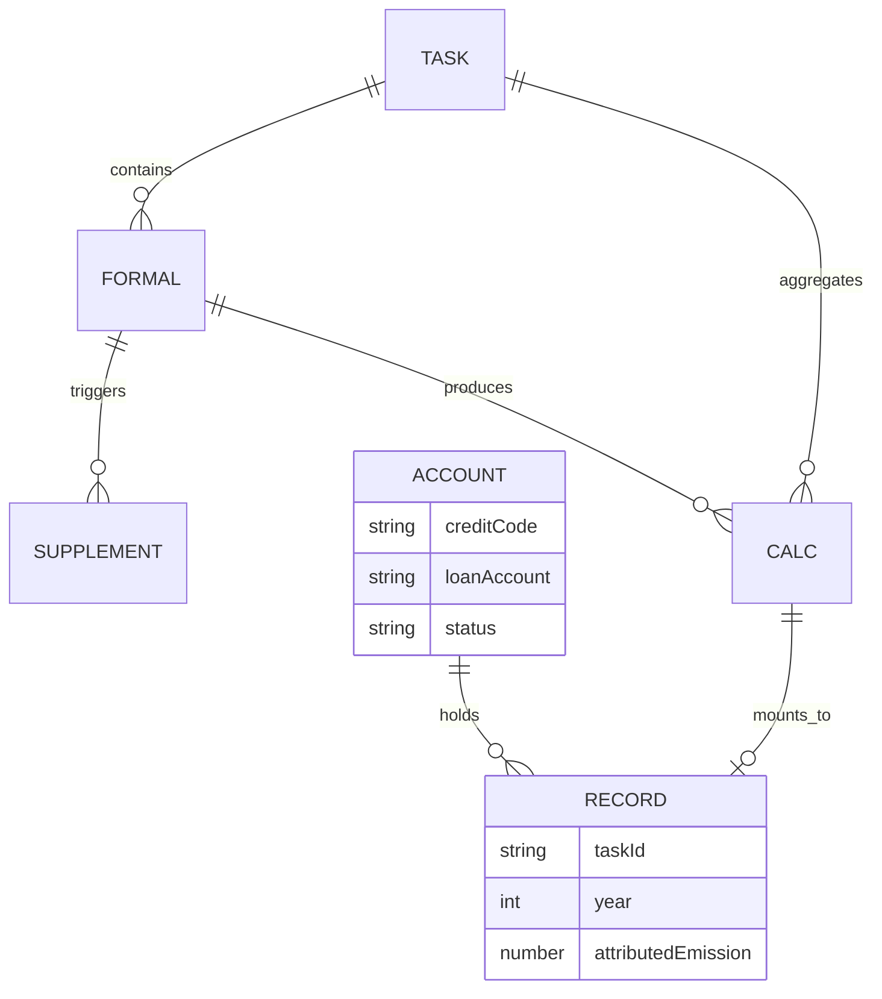

# 华夏银行绿金系统  
# 投融资碳核算与企业碳账户 — 项目需求说明书

| 文档属性 | 内容 |
|---------|------|
| 文档名称 | 项目需求说明书 |
| 文档版本 | v0.1 |
| 定稿日期 | 2026-05-27 |
| 文档状态 | 讨论稿（供业务与系统需求确认） |
| 编制依据 | 《【讨论稿】华夏银行投融资碳核算-业务流与系统功能》；《商业银行投融资业务碳核算与报告指南》；绿金系统演示原型及用户操作手册 v0.2 |

---

## 1. 文档说明

### 1.1 编写目的

本文档用于**确认**华夏银行绿金系统中「投融资碳核算」与「企业碳账户」两大模块的**业务需求**与**系统需求**，作为项目组与业务部门对齐建设范围、流程边界和能力的共同依据。

本文档**不是**详细需求规格说明书，不包含功能编号、界面级操作步骤、接口报文、实施计划、风险分析及验收用例等实施与测试类内容。操作层面的说明见《用户操作手册》；监管公式与字段级对齐见《指引对齐补充》等专册。

### 1.2 项目背景与建设目标

华夏银行需对投融资组合开展碳排放核算，满足**监管报送**与**内部绿色金融管理分析**需要。相关能力以**功能模块形式嵌入现有绿金系统**，不单独建设独立系统。

**建设目标：**

- 形成「总行定规则、分行做组织、客户经理补信息、系统做计算」的核算协同模式；
- 按监管指引完成从业务识别、数据采集、排放计算到报告输出的闭环；
- 建设**企业碳账户**，在核算确认后将结果按客户（法人+贷款号）长期归集，支撑查询、分析与账户管理；
- 审批、组织权限、待办等**沿用绿金系统既有能力**，碳核算侧提供业务单据与「提交审核」衔接，不重复建设审批引擎。

### 1.3 建设范围

**本期纳入：**

| 模块 | 说明 |
|------|------|
| 投融资碳核算 | 核算任务、清单识别与确认、对象边界、补数协同、方法与因子、排放计算与结果确认、报告输出、信贷台账接入 |
| 企业碳账户 | 账户建档与归集、列表与详情查询、排放明细、多维汇总与趋势分析、账户状态管理（总行）、辖内数据权限（分行） |
| 与宿主集成 | 提交审核及审批状态回写；组织与数据权限沿用绿金系统 |

**本期不纳入（边界外）：**

- 独立审批流程引擎、审批节点配置、待办中心（均由绿金系统承担）；
- 集团合并核算规则（例外场景本期不做）；
- 复杂管理驾驶舱、深度数据质量评价模块（可作后续增强，本期以计算环节提示为主）；
- 独立建设的碳核算系统或与绿金脱钩的部署形态。

### 1.4 术语与角色

**常用术语**

| 术语 | 说明 |
|------|------|
| 八大高碳行业 | 电力、建材、钢铁、有色、石化、化工、造纸、民航等监管重点行业 |
| 8+15 行业 | 八大行业及扩展行业组合，用于管理分析全量口径；监管输出按人行要求范围提取 |
| 候选清单 | 系统按规则从信贷台账等数据中筛选的初步待核算范围 |
| 正式清单 | 管理端确认并锁定后的待核算业务清单 |
| 补数任务 | 针对正式清单向分行/客户经理派发的字段与材料填报任务 |
| 主体排放 / 归因排放 | 融资主体（或项目）排放量；按融资占比归因至本行的排放量 |
| 企业碳账户 | 以「统一社会信用代码 + 贷款号」为唯一标识的客户维度账户，用于归集已确认核算排放记录 |
| 排放记录 | 单次核算任务中，某笔业务在【确认结果】后写入碳账户的一条历史排放数据 |

**用户角色**

| 角色 | 职责概要 |
|------|----------|
| 总行绿金/管理部门 | 发起或统筹核算任务；确认清单与边界；组织补数与计算；确认核算结果；监管与管理报告输出；全行碳账户查询及账户状态管理 |
| 分行绿金负责人 | 可发起辖内相关任务；组织辖内补数与进度跟踪；数据审核（初审或终审，视任务发起方式）；辖内碳账户查询 |
| 客户经理/业务人员 | 接收补录任务，在线填报信息与附件，提交审核；**无**企业碳账户菜单 |
| 系统管理员 | 行业映射、因子与参数等配置（组织权限沿用绿金系统） |
| 系统自动处理 | 清单筛选、任务派发、方法匹配、排放计算、结果汇总、碳账户归集 |

---

## 2. 系统总体说明

### 2.1 系统定位

投融资碳核算与企业碳账户均为**绿金系统嵌入式子模块**，与信贷数据、既有审批及权限体系协同，为同一业务条线下的前后衔接能力：

- **投融资碳核算**：以**核算任务**为主线，完成某一年度（或专项）从识别、补数、计算到报告的一次性闭环；
- **企业碳账户**：以**客户+贷款**为主线，沉淀多次核算已确认结果，支持跨任务、跨年度查询与分析。

### 2.2 两大模块及关系

**衔接原则：**

1. 仅在核算任务内完成排放计算，并由总行在「排放计算」环节执行**【确认结果】**后，方将对应业务的排放数据写入企业碳账户；
2. 未锁定正式清单、补录未完成或已退回、计算未完成、任务未确认结果的数据**不得**进入碳账户；
3. 任务级监管/管理报告仍在核算模块导出；碳账户侧重客户维度的历史排放台账、结构分析与明细导出，二者互补。

### 2.3 与外部系统及宿主能力

| 对象 | 关系说明 |
|------|----------|
| 信贷核心 / 主生产系统 | 提供贷款台账、客户基础信息等；支持接口同步，并保留模板导入导出作为兜底 |
| 数据中台（如有） | 可作为台账统一接入层 |
| 绿金系统（宿主） | 提供审批流、组织树、角色与数据权限、待办与操作日志；碳核算模块嵌入并调用 |
| 公开数据（如有） | 用于补数前预填充，具体范围待与数据源方确认 |

**数据接入原则（业务倾向）：** 台账数据进入绿金后按规则筛选形成候选清单；贴现、保理等缺信贷金额的业务需客户经理补录后方可计算。

### 2.4 用户角色与模块可见范围

| 能力 | 总行 | 分行 | 客户经理 |
|------|:----:|:----:|:--------:|
| 核算任务全流程 | ✓ | 部分（发起/查看辖内） | ✗ |
| 数据补录与在线填报 | 组织侧 | ✓ 辖内 | ✓ 本人任务 |
| 数据审核 | 总行终审（总行发起任务） | 分行初审或终审 | 仅查看本人进度 |
| 企业碳账户 | ✓ 全行 + 状态管理 | ✓ 辖内查看 | ✗ |
| 排放因子库 / 接口管理 | ✓ | ✓（按行内授权） | ✗ |

---

## 3. 业务需求

### 3.1 投融资碳核算业务需求

#### 3.1.1 要解决的业务问题

- 按监管指引识别应纳入核算的投融资业务，并形成可审计的正式清单；
- 在数据不完整时，通过分行组织、客户经理补录，补齐核算所需信息与材料；
- 按业务类型与数据可得性选用合适核算方法，自动完成主体排放与归因排放计算；
- 经审批确认后，输出监管报送及管理分析所需结果；
- 支持 8+15 等行业全量计算，监管报告按人行范围提取。

#### 3.1.2 组织与协同模式

- **规则集中**：总行（或授权分行）确定核算年度、行业范围、组织范围及输出目标；
- **组织协同**：分行负责辖内补数进度统筹与数据审核，避免总行逐笔催数；
- **责任清晰**：客户经理仅负责按任务提供信息与附件，不定义核算口径；
- **计算自动化**：方法匹配、因子调用、排放量计算与汇总由系统完成，关键参数可配置并留痕。

#### 3.1.3 任务发起与审核分工

核算任务可由**总行发起**或**分行发起**（二选一或按行内制度配置）：

| 发起方式 | 组织范围 | 数据审核特点 |
|----------|----------|----------------|
| 总行发起 | 全行或指定范围 | 客户经理提交后，分行**初审**，总行**终审**，通过后进入计算 |
| 分行发起 | 本分行业务 | 客户经理提交后，分行**终审**即可，无需总行终审 |

无论何种发起方式，正式清单确认锁定后，补数、计算、确认结果与报告输出流程一致。

#### 3.1.4 主业务流程

业务流程按以下阶段推进（与监管「四阶段」工作程序相对应）：

| 阶段 | 业务活动 | 主要产出 |
|------|----------|----------|
| 范畴确定 | 创建核算任务，明确年度、行业、组织范围、输出目标 | 核算任务 |
| 清单识别 | 同步信贷台账，按规则生成候选清单，管理端确认生成正式清单 | 候选清单、正式清单 |
| 对象边界 | 确认核算对象（主体/项目）、排放边界与周期，锁定清单 | 锁定后的正式清单、边界说明 |
| 数据采集 | 派发补录任务或经济法直算；分行组织；客户经理填报并提交审核 | 补全的数据与附件 |
| 排放计算 | 方法匹配与计算，核对汇总结果 | 主体/归因排放结果 |
| 结果确认 | 总行【确认结果】（触发碳账户归集），生成任务级报告 | 确认后的核算结果、报告文件 |

审批在清单、补数或结果等节点通过绿金系统**提交审核**完成，具体节点以宿主审批配置为准；退回后可在对应业务环节修改并再次提交。

#### 3.1.5 关键业务规则（摘要）

- **纳入与排除**：对公信贷中符合八大高碳等行业规则的业务纳入；按指引配置排除规则（如低余额、小微、境外主体、非高碳行业等），具体阈值与编码以行内确认版为准；
- **清单流转**：候选清单（系统生成）→ 人工确认 → 正式清单（锁定），锁定后变更须留痕；
- **方法选择**：系统按报告法、能源法、产品法、经济法、余额兜底等优先级自动匹配，支持在数据允许范围内由客户经理在指引允许的方法中填报；因子与归因规则可配置；
- **口径**：支持监管范围与管理全量分别输出；余额口径（日均/月均等）在任务级配置；
- **特殊业务**：贴现、保理等缺系统金额的业务，须客户经理补录后方可计算。

### 3.2 企业碳账户业务需求

#### 3.2.1 建设目的

在单次核算任务之外，为经营与管理提供**客户维度**的碳排放视图：同一融资客户在多次核算、多个年度下的归因排放可追溯、可汇总、可对比，支撑内部分析、客户沟通及与核算任务的回溯核对。

#### 3.2.2 账户认定与建档

- 账户唯一标识：**统一社会信用代码 + 贷款号**（同一组合仅一个账户）；
- 账户在**首次**有符合归集条件的排放记录写入时自动建立，并记录企业名称、行业、主办一级分行等档案信息；
- 后续同一组合的核算确认结果，归集至同一账户下，形成多条**排放记录**（按核算年度、任务区分）。

#### 3.2.3 数据归集规则

**纳入碳账户：**

- 所属核算任务已执行【确认结果】；
- 对应业务在正式清单中已锁定，且该笔计算已完成（含归因排放）；
- 具备有效的统一社会信用代码与贷款号。

**不纳入：**

- 仅处于候选/待确认清单、补录中、已退回、未计算或任务未确认结果的数据；
- 缺少账户主键字段无法建档的记录。

归集时机：与任务【确认结果】同步（或在该操作完成后立即完成），无需客户经理或分行手工「入账」。

#### 3.2.4 账户管理与查看

- **总行**：可查看全行账户；可对账户执行**启用、停用、注销**等状态管理，并保留状态变更记录；
- **分行**：仅可查看本**一级分行**辖内账户及明细（含辖内各经办行记录），不可变更账户状态；
- **客户经理**：不提供碳账户功能入口。

#### 3.2.5 分析与输出

- 支持按核算年度切换查看账户列表及统计；
- 账户详情提供：档案信息、排放明细（字段与信贷台账列对齐，并展示核算年度、排放值、方法、完成时间等）、多维汇总（如项目/非项目、行业、贷款类型等）、年度趋势及贷款余额碳强度趋势；
- 支持排放明细导出，供内部分析使用；**不替代**任务级监管报告模板导出。

#### 3.2.6 与核算任务、监管报送的关系

| 维度 | 投融资碳核算 | 企业碳账户 |
|------|----------------|------------|
| 组织方式 | 按任务、按年度 | 按客户、跨任务跨年 |
| 典型用途 | 当期核算、审批、监管/管理报告 | 客户历史排放台账、结构分析 |
| 输出 | 任务报告、清单导出等 | 账户明细导出、图表汇总 |
| 关系 | 源头 | 结果沉淀；通过排放记录关联原任务 |

### 3.3 跨模块业务规则与典型场景

**边界：** 核算模块负责「算准当期、审完确认、出任务报告」；碳账户负责「已确认结果的长期归集与查询」。不在碳账户中修改核算结果，若需更正应通过核算任务退回、重算、再确认，并更新或覆盖对应排放记录（具体覆盖策略待确认）。

**典型场景：**

1. 完成某年度核算任务并【确认结果】后，相关客户在「企业碳账户」中可见新增或更新的排放记录；
2. 同一客户、同一贷款号参与下一年度另一任务且再次确认后，账户下出现新年度记录，趋势分析可展示多年变化；
3. 分行负责人仅能看到北京分行主办或辖内经办的业务对应账户，与补录、审核权限范围一致。

---

## 4. 系统需求（功能层面）

以下按模块描述系统应提供的**能力**，不限定实现方式与界面细节。

### 4.1 投融资碳核算

| 模块 | 系统能力要求 |
|------|----------------|
| 核算任务管理 | 按年度（或专项）创建、配置、启动任务；配置行业范围、组织范围、输出目标；任务列表查询与生命周期管理；任务进度总览（面向管理） |
| 业务识别与清单 | 从信贷台账同步或导入数据；按规则生成候选清单；支持筛选条件调整与人工确认；生成并锁定正式清单；清单版本留痕 |
| 核算对象与边界 | 维护非项目/项目类核算对象、边界说明、核算周期等，与正式清单一致 |
| 补数协同 | 按正式清单生成并派发补录任务；支持经济法直算类业务处理；分行补录看板、客户经理任务清单与在线填报（含附件）；填报进度与驳回重填 |
| 方法与因子 | 排放因子库维护；方法优先级与匹配规则配置；支持五类方法相关的参数维护 |
| 碳排放计算 | 单笔与批量计算；展示主体排放、归因排放及汇总；异常与缺失提示；【确认结果】并驱动后续报告与碳账户归集 |
| 审核对接 | 在业务节点提供「提交审核」；展示审批状态；审批退回后解锁对应环节并支持再提交；审批流转由绿金系统执行 |
| 结果与报告 | 核算结果查询；按监管/管理口径配置导出范围与模板；生成并下载 Excel/Word 等报告（模板由行方提供） |
| 数据接入 | 信贷台账接口批次管理（含失败重试）；模板导入导出兜底；字段与行业映射维护 |

### 4.2 企业碳账户

| 模块 | 系统能力要求 |
|------|----------------|
| 账户列表 | 按核算年度展示有排放记录的账户；统计可见账户数、归因排放合计、记录笔数；支持企业名称/信用代码/贷款号、一级分行、账户状态等筛选 |
| 账户详情 — 档案 | 展示客户、贷款、行业、主办分行、开户时间、账户状态及状态变更历史 |
| 账户详情 — 排放明细 | 列表展示已归集记录，字段与台账口径对齐，并含核算年度、主体/归因排放、碳强度、方法、完成时间等；支持筛选与分页 |
| 账户详情 — 多维汇总 | 按项目/非项目、行业、年度、贷款类型、经办行等维度汇总展示（图表或表格） |
| 账户详情 — 趋势分析 | 跨年度排放趋势、贷款余额碳强度趋势及年度明细表 |
| 账户状态管理 | 总行对账户启用、停用、注销及再启用（规则见业务确认）；操作确认与留痕 |
| 数据权限 | 总行全行；分行按一级分行过滤；客户经理不可访问 |
| 明细导出 | 按当前筛选条件导出排放明细文件 |

### 4.3 共性系统要求

| 类别 | 要求 |
|------|------|
| 权限与数据范围 | 与绿金系统角色一致；模块内菜单与数据按角色、机构过滤 |
| 可追溯 | 关键操作（清单锁定、确认结果、账户状态变更、报告生成等）可留痕，满足内控与审计需要 |
| 性能 | 支持全行量级台账筛选、批量计算及碳账户列表/明细分页查询；具体指标在详细设计阶段与科技共同约定 |
| 安全 | 按行内信息安全要求控制访问与导出；敏感字段展示与脱敏遵循行内规范 |
| 可用性 | 与绿金系统一致的服务可用性与备份策略 |

---

## 5. 主要数据与口径要求

### 5.1 核心数据对象及关系

- **核算任务**：一次核算工作的容器，含年度、范围、状态、是否已确认结果等；
- **候选/正式清单**：业务笔维度，正式清单锁定后与对象边界、补录、计算关联；
- **补录任务**：指向正式清单笔，含填报状态与审核状态；
- **计算结果**：主体排放、归因排放、方法、余额等；
- **碳账户**：客户+贷款维度主数据；
- **排放记录**：某任务某笔业务在确认结果后的归集快照，关联任务与计算标识以便追溯。

### 5.2 关键口径

| 口径项 | 要求 |
|--------|------|
| 行业 | 行内代码与监管八大高碳及 8+15 映射可维护；监管输出按人行范围提取 |
| 排放 | 区分主体排放与归因排放；归因规则与指引一致，参数可配置 |
| 核算年度 | 任务年度与排放记录年度一致；碳账户列表支持按年度切换 |
| 台账字段 | 候选清单、碳账户排放明细与信贷台账关键列对齐，减少重复解释 |
| 数据质量 | 可对单笔数据标注质量等级或 DQR（本期可做基础提示，深度评价可作增强） |

### 5.3 数据质量与完整性原则

- 正式清单锁定前允许调整候选范围；锁定后补录与计算以正式清单为准；
- 计算前须满足该方法必填字段；缺失时提示或阻断并支持补录；
- 碳账户仅接收已确认数据，保证账户内数据与任务确认结果一致。

---

## 6. 待确认事项

以下事项需在业务评审会上确认后，纳入下一版需求说明书或作为详细设计输入。

| 序号 | 主题 | 待确认内容 |
|------|------|------------|
| C01 | 组织范围 | 任务组织范围是否细化到支行；境外网点是否纳入 |
| C02 | 数据接入 | 主系统预筛后接口，还是全量接入绿金后筛选 |
| C03 | 行业映射 | 8+15 行业与行内、监管代码映射是否统一发布 |
| C04 | 补数模式 | 是否统一采用「分行组织、客户经理填报」；本期是否必须全量在线补录 |
| C05 | 方法下发 | 五种方法是否全部对客户经理展示自选，还是总行指定后填报 |
| C06 | 审批对接 | 可提交审核的单据类型、状态码与退回解锁规则（与绿金系统联合确认） |
| C07 | 报告模板 | 监管与管理报告模板、导出维度由行方提供的清单与时间表 |
| C08 | 碳账户 — 更正 | 核算结果更正后，碳账户内对应记录是覆盖、冲正还是保留多版本 |
| C09 | 碳账户 — 停用 | 停用/注销账户是否仍参与历史统计展示；注销后是否允许再启用 |
| C10 | 碳账户 — 报送 | 是否存在独立于任务报告的「碳账户监管报送」模板需求 |
| C11 | 数据质量 | 与第三方或联合赤道等合作的验证规则与阈值是否本期落地 |

---

## 7. 附录

### 附录 A  修订记录

| 版本 | 日期 | 修订说明 | 作者 |
|------|------|----------|------|
| v0.1 | 2026-05-27 | 首版：投融资碳核算与企业碳账户业务与系统需求确认稿 | — |

### 附录 B  相关文档

| 文档 | 用途 |
|------|------|
| 《华夏银行投融资碳核算-需求规格说明书》及《指引对齐补充》 | 功能与监管细节参考，不作为本文档替代 |
| 《华夏银行投融资碳核算-用户操作手册》v0.2 | 操作步骤与界面说明 |
| 《商业银行投融资业务碳核算与报告指南》 | 监管合规依据 |

### 附录 C  监管工作程序与系统模块对应（摘要）

| 监管阶段 | 投融资碳核算 | 企业碳账户 |
|----------|----------------|------------|
| 核算业务范畴 | 核算任务、行业与组织范围 | — |
| 对象/边界/周期 | 正式清单、对象边界 | — |
| 数据采集与质控 | 补数协同、审核 | — |
| 排放量计算 | 排放计算、确认结果 | 归集排放记录 |
| 结果运用 | 任务报告输出 | 客户维度查询与分析 |

---

*本文档用于业务与系统需求确认。确认结论及待决事项 closure 后，发布 v0.2 及以上版本。*
